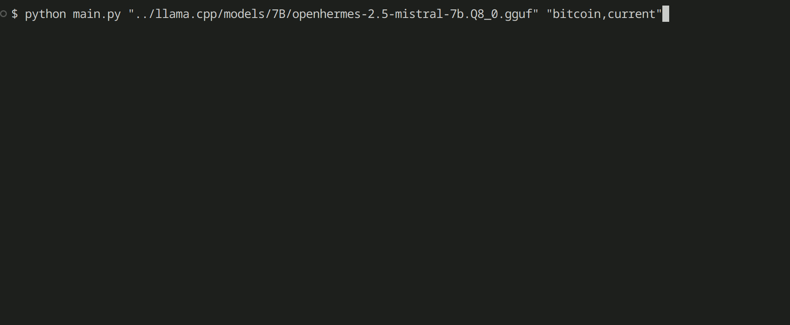

# Fortuna - find price data easily and immediately using an LLM

The goal of this project is to show how easy it is to interact with an LLM for the purpose of data discovery and obtainment.

In particular, this software uses an LLM to handle the following aspects:

* where on the internet to find the data
* how to obtain the data and then automatically writing python code
* an option to immediately run the python code
* prints both the python code and the output data to stdout console
    * the output can then, in theory, be used as part of an ETL process
    * alternatively the end-user can copy python code and use it in other projects

Right now it can find data for the following:

* current price of bitcoin
* current price of ethereum
* current price of popular US equities; e.g. AMD or TSLA or NVDA
* past seven days of closing price history of popular US equities



### Why?

This is primarily meant to be a simple experiment and not necessarily a production worthy system.

Since the entire point of using an LLM is because you want super-human capabilities, this type of system would be applicable only in certain situations. When dealing with problem of data discovery, it might be nice to obtain data from a number of sources all at once, or examine a large pool of potential sources and prototype easily. Another issue is that data is found is a large variety of formats and so it would be nice to standardize this somehow and offer an omni-interface for ease-of-use.

These problems are interesting since it demonstrates the scope of what is required for an LLM-based system to produce a useful result.

A possible architecture for a production-worthy system, plus some ways to extend it, would be as follows:

* two LLMs
    * first LLM, trained or fine-tuned on a list of common data sources, along with some method of how to access them; e.g. API, database, CSVs, etc
    * second LLM, trained or fine-tuned on common python problem solving, which would take the information presented by the first LLM and attempt to generate code
    * would likely need to be small models, such as a 7 billion parameter parameter
    * (optional) good-quality quantized models, in order to improve token-per-second performance

* the first LLM is trained on prompts in such a way that it selects relevant external sources
    * needs obtain the data from the internet or some other source
    * given that the LLM dataset would always be out of date or non-existent and retraining is expensive
    * LLMs also commonly hallucinate and thus are always untrustworthy to some extent; an independent external source is more likely to be correct

* the second LLM is trained on prompts in such a way that it selects relevant python data ETL techniques
    * uses python, since this is a very popular language present in the training datasets of
    * current off-the-shelf LLMs are trained on scraped code which solve very simple problems, making them limited
    * one interesting angle might be to have the LLM handle analytics via generation of python code; which could become a tool for data analysis by offering the ability to rapidly prototype new ideas

* a method to have the first or second LLM re-run in the scenario where output failed
    * the output of an LLM is somewhat non-deterministic unless very specific prompts are used
    * would need some sort of way to re-run
    * a fallback non-LLM system could help with this as well

* some way to store the data
    * mostly straightforward, can write to a database or data file

Knowing all of this I believe a production level system would be a serious research undertaking, however, it seems at least in principle to be very possible with a bit of effort invested.

Far in the future, maybe with a model that is very example rich and yield low perplexity output, it could in theory allow you to create an ETL system with the ability to download data in any format imaginable, as the LLM could make an intelligent guess and be right more-often-than-not.

### Requirements

* latest version of Python
* an open LLM that equals or exceeds ChatGPT 3.5 capabilities; e.g. Mistral, OpenHermes, Yi
* (optional) quantize the model to improve tokens-per-second performance

### Setup instructions

Download a high capability LLM to ensure best results; a popular choice is the quantized OpenHermes model:

https://huggingface.co/TheBloke/OpenHermes-2.5-Mistral-7B-GGUF

Then create a python env and switch to it:

```bash
python -m venv /path/to/llm_venv
source /path/to/llm_venv/bin/activate
```

Add the llama.cpp python wrappers:

```bash
python -m pip install llama-cpp-python
```

### Usage

Some examples are presented below...

Current price of BTC:

```bash
python main.py "/path/to/openhermes-2.5-mistral-7b.Q8_0.gguf" "bitcoin,current"
```

Current price of ETH:

```bash
python main.py "/path/to/openhermes-2.5-mistral-7b.Q8_0.gguf" "ethereum,current"
```

Current price of INTC:

```bash
python main.py "/path/to/openhermes-2.5-mistral-7b.Q8_0.gguf" "ticker=INTC,current"
```

Closing price history of TSLA over the last seven days:

```bash
python main.py "/path/to/openhermes-2.5-mistral-7b.Q8_0.gguf" "ticker=TSLA,previous_seven_days"
```
